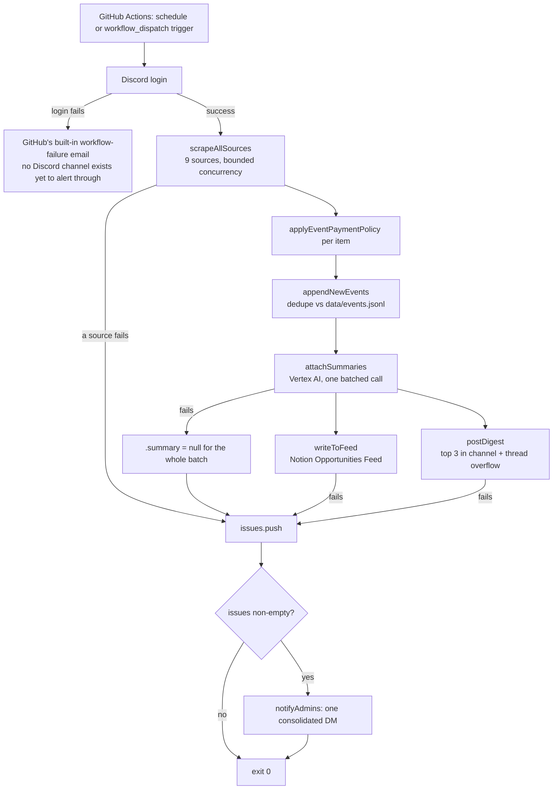

# Architecture

See [README.md](./README.md) first for the map.

## End-to-end flow, as actually wired today



This is what actually runs — no separate always-on process, no in-repo
scheduler. See [the hosting section below](#hosting-github-actions) for
why.

```
config/sources.json (9 registered sources, 1 disabled)
        │
        ▼  src/sources/index.js: loadEnabledSources() + fetchFromSource()
┌────────────────────────────────────────────────────────────────┐
│  src/sources/*.js  (one module per source, own browser/API call) │
│  each exports fetchOpportunities(sourceConfig) -> Opportunity[]  │
│  already normalized via src/lib/normalize.js's normalizeOpportunity │
└────────────────────────────────────────────────────────────────┘
        │  src/pipeline.js: scrapeAllSources() — bounded concurrency
        │  (SCRAPE_CONCURRENCY), per-source try/catch isolation.
        │  A thrown per-source error is collected into `issues`, NOT
        │  treated the same as a source returning [] (e.g. work-ua's
        │  permanent Cloudflare block returns [] without throwing --
        │  that's "0 results," not a "failure," and doesn't alert).
        ▼
  applyEventPaymentPolicy() per item (src/lib/normalize.js)
  — drops paid non-fellowship courses/events, clears payment
    on free non-fellowship events, leaves jobs/kaggle untouched
        │
        ▼
  appendNewEvents() (src/lib/store.js)
  — dedupes by sha256 id against data/events.jsonl, atomic write
        │
        ▼
  attachSummaries() (src/lib/summarize.js)
  — one batched Vertex AI (Gemini) call for the whole new-events batch,
    asks for a JSON array of {id, summary}. ANY failure (auth, network,
    bad JSON, HTTP error) degrades every item's .summary to null rather
    than throwing -- never blocks what comes next.
        │
        ├──────────────────────────────┐
        ▼                              ▼
  writeToFeed() (src/lib/notion-feed.js)   postDigest() (src/discord/digest.js)
  — writes NEW, non-notion-sourced          — top 3 by score in the channel
    opportunities to "Opportunities Feed"     message, the rest in a thread,
    in Notion, each with a heuristic          chunked 5/message. Ranked
    Score (src/lib/scoring.js) and a          against the FULL catalogue
    Summary when one came back from the       (loadEvents() re-read after
    Vertex AI call above (omitted, not         append), not just today's
    left blank with a placeholder,             batch. Shows .summary if
    otherwise).                                present, otherwise no
                                                description line at all.
        │                                       │
        └───────────────────┬───────────────────┘
                             ▼
                any problem from either step above (or from scraping)
                is collected into `issues` and DMed ONCE per run to every
                ADMIN_DISCORD_USER_IDS admin (src/discord/alerts.js) --
                "alert on every failure, no exceptions," batched into one
                message rather than one DM per problem.
```

`src/index.js` is the entrypoint: log into Discord, run the pipeline
**once**, destroy the client, exit — `.github/workflows/daily-digest.yml`
is what fires that once a day (`schedule`) or on demand
(`workflow_dispatch`); there is no in-repo scheduler or long-lived process
any more (`src/scheduler.js` and the `node-cron` dependency were deleted
once GitHub Actions took over that job). A fatal startup error attempts a
best-effort admin DM if the client managed to log in first — if login
itself is what failed, there's no logged-in client to alert through, and
GitHub Actions' own "workflow run failed" email (sent to the repo owner
by default) covers that gap from the infrastructure side instead.

On the very first run ever (empty `data/events.jsonl`), `pipeline.js`
caps what gets posted to the newest 15 items
(`FIRST_RUN_POST_CAP`/`pickFirstRunBatch()`) so a cold start — e.g. the
very first GitHub Actions run, with no cache to restore — doesn't dump
every source's entire current listing into the digest thread at once.
Everything scraped is still recorded in the store regardless, so nothing
gets reposted as "new" on a later run. The Notion Feed write is never
capped this way — every genuinely new item still gets a row there.

## Hosting: GitHub Actions

`.github/workflows/daily-digest.yml` — `schedule` (cron, UTC) +
`workflow_dispatch` triggers, a `concurrency: { group: daily-digest }`
block as the overlap guard (replaces the old in-memory `running` boolean —
GitHub queues/skips overlapping runs of the same group natively, and this
guard now holds across processes/machines too, not just within one). Each
run: checkout → restore `data/events.jsonl` from `actions/cache`
(`github.run_id`-suffixed save key, prefix-matched `restore-keys` on
restore — the standard "rolling state" idiom) → `npm ci` → install
Playwright's Chromium → write the Vertex AI service-account secret to a
temp file → `node src/index.js` → save `data/events.jsonl` back to the
cache (an `if: always()` step, so a mid-run crash doesn't lose whatever
was already scraped/deduped before it).

`data/events.jsonl` stays `.gitignore`d — cache persists it across runs
without committing runtime data into the repo's history. Accepted
tradeoff: a crash *after* posting/writing but *before* the cache-save step
can cause a rare duplicate post/Notion row on the next run (the restored
cache wouldn't yet reflect what that crashed run already did) — chosen
over saving state right after dedupe/before posting, which would risk
silently losing an item forever if posting then failed.

All secrets (bot token, channel id, Notion/Vertex AI credentials, admin
ids) live in the GitHub repo's Actions secrets, not in any committed
file. Local development is unaffected — `npm start` still reads the local
`.env` exactly as before; this only removed the *always-on* mode.

## What's actually wired in

Historically this table distinguished "wired in" from "built but dormant."
As of the digest.js/alerts.js work, **everything in this repo's `src/` is
wired into `runPipeline()`** — there is no more dormant-but-built code.
`discord/post.js` (the old one-embed-per-item format) was deleted outright
once `digest.js` replaced it and nothing referenced it any more, rather
than left around unused.

| Capability | Module |
|---|---|
| Scrape all sources | `sources/index.js`, `sources/*.js` |
| Payment policy filter | `lib/normalize.js` |
| Dedupe/store | `lib/store.js` |
| Heuristic score | `lib/scoring.js` (used by `writeToFeed` and `digest.js`) |
| Vertex AI (Gemini) summarization | `lib/summarize.js` |
| Write to Notion Feed (incl. Summary) | `lib/notion-feed.js` |
| Components V2 digest (top-3 + thread, percentile accent colors) | `discord/digest.js`, `discord/score-color.js` |
| Admin DM alerts on every issue | `discord/alerts.js` |
| Read Score/Hook/Summary back from Notion | *(doesn't exist yet — see [PLAN.md](../PLAN.md))* |
| Discord forum-channel / x.com sources | *(doesn't exist yet — backlog, see [PLAN.md](../PLAN.md))* |

`lib/summarize.js` went from a direct Gemini API-key call (which failed —
`GEMINI_API_KEY` turned out not to be a plain AI Studio key) to Vertex AI
with ADC/OAuth2 auth (`google-auth-library`, `GOOGLE_APPLICATION_CREDENTIALS`)
— see [assumptions-and-caveats.md](./assumptions-and-caveats.md) for that
whole story.

**One gap left, and it's not code**: `DISCORD_CHANNEL_ID` (in the GitHub
Actions secrets once configured, and still in local `.env`) needs to
point at a real production channel — right now both point at the test
channel used for every live demo this session. That's a manual step (invite
the bot to the real server, copy the channel id), not something to fix by
writing more code. See [assumptions-and-caveats.md](./assumptions-and-caveats.md)
and [resilience.md](./resilience.md) for the remaining honest caveats
(there's no retry/backoff anywhere, no expiry filtering, etc. — being
"wired in" and being "hardened" are different things).

## Module responsibilities (one line each)

- `src/index.js` — entrypoint: login, run once, destroy client, exit;
  best-effort alert on fatal startup errors.
- `src/pipeline.js` — orchestrates one full run: scrape → filter → dedupe
  → summarize → Notion write → Discord digest post → alert on any issues.
- `src/sources/index.js` — reads `config/sources.json`, dynamic-imports the
  right module per source, dispatches `fetchOpportunities(sourceConfig)`.
- `src/sources/*.js` — one per source; see [sources.md](./sources.md).
- `src/lib/normalize.js` — the `Opportunity` shape contract, id hashing,
  date parsing, keyword-based tag/location inference, the payment policy
  filter, `isFellowship()`.
- `src/lib/scoring.js` — `scoreOpportunity()`, the 0-100 heuristic. See
  [scoring-and-highlighting.md](./scoring-and-highlighting.md).
- `src/lib/store.js` — JSONL load/append with atomic write + id dedupe.
- `src/lib/notion-feed.js` — writes to the "Opportunities Feed" Notion
  database. See [notion-integration.md](./notion-integration.md).
- `src/lib/summarize.js` — Vertex AI (Gemini) one-sentence summarization,
  batched, JSON-mode, OAuth2/ADC auth.
- `src/discord/client.js` — logs into Discord, resolves on ready.
- `src/discord/digest.js` — the top-3-plus-thread Components V2 digest,
  the sole production posting path. See
  [discord-integration.md](./discord-integration.md).
- `src/discord/score-color.js` — percentile-to-accent-color mapping used
  by `digest.js`.
- `src/discord/alerts.js` — best-effort admin DMs, never throws.

## Opportunity shape

Every source module returns objects matching this shape (frozen by
`normalizeOpportunity()` in `src/lib/normalize.js`):

```
{
  id, sourceId, kind ('event'|'job'), title, link,
  date, dateNormalized, dateEndNormalized, datePrecision,
  location, payment, tags, description, company, calendar,
  firstSeenAt,
  // added later in the pipeline, not by normalizeOpportunity itself:
  summary   // lib/summarize.js's attachSummaries() -- always called for
            // new events; null if Vertex AI failed/hasn't run for this item
  hook      // only if a future Notion-read-back step attaches it (doesn't exist yet)
}
```
