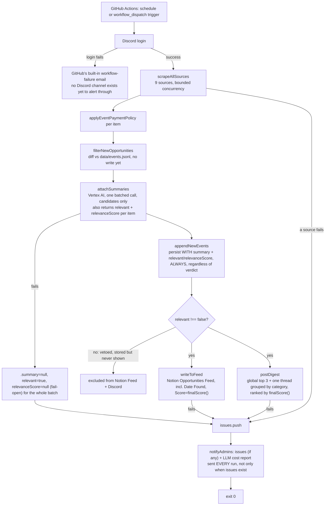

# Architecture

See [README.md](./README.md) first for the map.

## End-to-end flow, as actually wired today



This is what actually runs — no separate always-on process, no in-repo
scheduler. See [the hosting section below](#hosting-github-actions) for
why.

```
config/sources.json (9 registered sources, 1 disabled)
        │
        ▼  src/sources/index.js: loadEnabledSources() + fetchFromSource()
┌────────────────────────────────────────────────────────────────┐
│  src/sources/*.js  (one module per source, own browser/API call) │
│  each exports fetchOpportunities(sourceConfig) -> Opportunity[]  │
│  already normalized via src/lib/normalize.js's normalizeOpportunity │
└────────────────────────────────────────────────────────────────┘
        │  src/pipeline.js: scrapeAllSources() — bounded concurrency
        │  (SCRAPE_CONCURRENCY), per-source try/catch isolation.
        │  A thrown per-source error is collected into `issues`, NOT
        │  treated the same as a source returning [] (e.g. work-ua's
        │  permanent Cloudflare block returns [] without throwing --
        │  that's "0 results," not a "failure," and doesn't alert).
        ▼
  applyEventPaymentPolicy() per item (src/lib/normalize.js)
  — drops paid non-fellowship courses/events, clears payment
    on free non-fellowship events, leaves jobs/kaggle untouched
        │
        ▼
  filterNewOpportunities() (src/lib/store.js)
  — diffs against data/events.jsonl by sha256 id, WITHOUT writing yet
        │
        ▼
  attachSummaries() (src/lib/summarize.js)
  — one batched Vertex AI (Gemini) call for just the new candidates,
    asks for a JSON array of {id, summary, relevant, relevanceScore,
    reason}. ANY failure (auth, network, bad JSON, HTTP error) fail-opens
    every item to {summary: null, relevant: true, relevanceScore: null}
    rather than throwing -- never blocks what comes next, and never
    silently vetoes something on account of an outage.
        │
        ▼
  appendNewEvents() (src/lib/store.js)
  — persists the now-summarized items atomically, UNCONDITIONALLY (every
    item, whichever way the LLM judged it -- see "LLM relevance veto"
    below for why); stamps `firstSeenAt` on anything that doesn't already
    have one (only sources/notion.js ever sets it directly, from Notion's
    own "Date found"). Summarizing BEFORE this write (not after, as it
    used to) is what lets `.summary`/`.relevant`/`.relevanceScore`
    actually end up in data/events.jsonl instead of being discarded once
    the run ends.
        │
        ▼
  filter to relevant !== false (src/pipeline.js)
  — items the LLM vetoed are already persisted above (never re-sent to
    the LLM on a later run) but are dropped here, before EITHER of the
    two branches below ever sees them.
        │
        ├──────────────────────────────┐
        ▼                              ▼
  writeToFeed() (src/lib/notion-feed.js)   postDigest() (src/discord/digest.js)
  — writes NEW, non-notion-sourced          — ONE titled channel message
    opportunities to "Opportunities Feed"     with the GLOBAL top 3 by
    in Notion, each with Score = finalScore() score (not top 3 per
    (src/lib/scoring.js -- heuristic          category); if there's more,
    blended with the LLM's relevanceScore),   ONE thread off it grouped by
    Payable checkbox (hasMoneyPrize()),       category (Hackathons/Events/
    Date Found (firstSeenAt), and Summary     Fellowship Programs/Jobs/
    when one came back from Vertex AI         Online Events). Ranked by
    (omitted, not left blank, otherwise).     finalScore() against the
                                               FULL catalogue (loadEvents()
                                               re-read after append), not
                                               just today's batch. Which
                                               items post -- see below.
        │                                       │
        └───────────────────┬───────────────────┘
                             ▼
                any problem from either step above (or from scraping) is
                collected into `issues`. notifyAdmins() (src/discord/
                alerts.js) is called EVERY run, not only when `issues` is
                non-empty -- issues (if any) plus an LLM token/cost report
                (this run / 7d / 30d / all-time, see "LLM usage & cost
                tracking" below) go to every ADMIN_DISCORD_USER_IDS admin
                in one DM, batched rather than one DM per problem.
```

### Which items actually get posted: `DIGEST_LOOKBACK_DAYS`

By default (this env var unset), `postDigest()` is called with exactly
this run's genuinely-new items (`appendNewEvents()`'s return value, first-
run-capped at 15 — see below) — for a strictly daily cadence, that's
already "what was found today," and it can never re-post the same item
twice no matter how many times the pipeline runs.

Setting `DIGEST_LOOKBACK_DAYS=N` (e.g. for an ad-hoc `npm start` or a
manually-dispatched Actions run) switches to a different, broader
selection instead: every item in the **full stored catalogue** whose
`firstSeenAt` falls within the last N days, regardless of which run
appended it. This is for a deliberate "show me everything found in the
last N days" request — confirmed live (`DIGEST_LOOKBACK_DAYS=3 npm
start`, `scraped=147 new=3 posted=yes ... (lookback=3d, toPost=3)`).
**Accepted tradeoff**: unlike the default mode, this WILL re-post an item
already posted earlier today if the pipeline runs more than once inside
the window — fine for a one-off retrospective look, not something the
scheduled GitHub Actions run should ever set.

### LLM usage & cost tracking

`src/lib/summarize.js`'s `summarizeOpportunities()` reads `usageMetadata`
(`promptTokenCount`/`candidatesTokenCount`/`totalTokenCount`) off every
successful Vertex AI response and reports it via an `onUsage(usage)`
callback — confirmed live these are real, non-trivial numbers (e.g. one
single-item test call: 436 prompt tokens, 57 candidate tokens, but 1299
*total* tokens — the gap suggests this model bills internal
reasoning/thinking tokens too, not just prompt+candidates; take
`totalTokenCount` as the authoritative figure, not the sum of the other two).

`src/lib/llm-usage.js` persists each call as one line in
`data/llm-usage.jsonl` (`recordUsage()` — plain append, no atomic-rewrite
needed since call order doesn't matter for aggregation) and aggregates
into four buckets (`summarizeUsage()`): this run, last 7 days, last 30
days, all-time. Like `data/events.jsonl`, this file is `.gitignore`d and
persisted across GitHub Actions runs via the same `actions/cache` step
(see [the hosting section](#hosting-github-actions)) — without that, the
weekly/monthly totals would silently reset to zero every run.

**Dollar cost uses a hardcoded pricing table** (`PRICING_SCHEDULE` in
`lib/llm-usage.js`), given directly by the user from Google's official
Vertex AI pricing for `GEMINI_MODEL` (`gemini-3.7-flash`): $0.75/1M input
tokens, $3.75/1M output+thinking tokens through 2026, doubling to
$1.50/$7.50 per 1M on **2027-01-01**. Each usage record is priced using
whichever tier was in effect on *that record's own timestamp*
(`priceFor()`), not "whichever tier applies today" — so a cost total that
spans the New Year boundary (e.g. a 30-day bucket computed in early
January) still prices December's calls at the December rate, not
retroactively at the new one. This table only covers what this codebase
actually calls (plain `generateContent`) — context caching and
Search/Maps grounding have their own separate pricing but aren't used
anywhere in this pipeline, so they're not modeled. **If `GEMINI_MODEL`
ever changes to a different model, this table needs updating by hand** —
there's no API this code calls to fetch live pricing, and no code here
verifies the table still matches reality.

This whole report — token counts and cost, always both, no
"unconfigured" state possible any more — is what gets appended to the
admin DM every run (see the alerting paragraph above and
[discord-integration.md](./discord-integration.md#admin-dm-alerts-now-sent-every-run-not-just-on-failure)).

`src/index.js` is the entrypoint: log into Discord, run the pipeline
**once**, destroy the client, exit — `.github/workflows/daily-digest.yml`
is what fires that once a day (`schedule`) or on demand
(`workflow_dispatch`); there is no in-repo scheduler or long-lived process
any more (`src/scheduler.js` and the `node-cron` dependency were deleted
once GitHub Actions took over that job). A fatal startup error attempts a
best-effort admin DM if the client managed to log in first — if login
itself is what failed, there's no logged-in client to alert through, and
GitHub Actions' own "workflow run failed" email (sent to the repo owner
by default) covers that gap from the infrastructure side instead.

On the very first run ever (empty `data/events.jsonl`), `pipeline.js`
caps what gets posted to the newest 15 items
(`FIRST_RUN_POST_CAP`/`pickFirstRunBatch()`) so a cold start — e.g. the
very first GitHub Actions run, with no cache to restore — doesn't dump
every source's entire current listing into the digest thread at once.
Everything scraped is still recorded in the store regardless, so nothing
gets reposted as "new" on a later run. The Notion Feed write is never
capped this way — every genuinely new item still gets a row there.

## Hosting: GitHub Actions

`.github/workflows/daily-digest.yml` — `schedule` (cron, UTC) +
`workflow_dispatch` triggers, a `concurrency: { group: daily-digest }`
block as the overlap guard (replaces the old in-memory `running` boolean —
GitHub queues/skips overlapping runs of the same group natively, and this
guard now holds across processes/machines too, not just within one). Each
run: checkout → restore `data/events.jsonl` from `actions/cache`
(`github.run_id`-suffixed save key, prefix-matched `restore-keys` on
restore — the standard "rolling state" idiom) → `npm ci` → install
Playwright's Chromium → write the Vertex AI service-account secret to a
temp file → `node src/index.js` → save `data/events.jsonl` back to the
cache (an `if: always()` step, so a mid-run crash doesn't lose whatever
was already scraped/deduped before it).

`data/events.jsonl` stays `.gitignore`d — cache persists it across runs
without committing runtime data into the repo's history. Accepted
tradeoff: a crash *after* posting/writing but *before* the cache-save step
can cause a rare duplicate post/Notion row on the next run (the restored
cache wouldn't yet reflect what that crashed run already did) — chosen
over saving state right after dedupe/before posting, which would risk
silently losing an item forever if posting then failed.

All secrets (bot token, channel id, Notion/Vertex AI credentials, admin
ids) live in the GitHub repo's Actions secrets, not in any committed
file. Local development is unaffected — `npm start` still reads the local
`.env` exactly as before; this only removed the *always-on* mode.

## What's actually wired in

Historically this table distinguished "wired in" from "built but dormant."
As of the digest.js/alerts.js work, **everything in this repo's `src/` is
wired into `runPipeline()`** — there is no more dormant-but-built code.
`discord/post.js` (the old one-embed-per-item format) was deleted outright
once `digest.js` replaced it and nothing referenced it any more, rather
than left around unused.

| Capability | Module |
|---|---|
| Scrape all sources | `sources/index.js`, `sources/*.js` |
| Payment policy filter | `lib/normalize.js` |
| Dedupe/store | `lib/store.js` |
| Heuristic score + LLM-blended `finalScore()` | `lib/scoring.js` (used by `writeToFeed` and `digest.js`) |
| Vertex AI (Gemini) summarization + relevance veto/score | `lib/summarize.js` |
| Write to Notion Feed (incl. Summary) | `lib/notion-feed.js` |
| Components V2 digest (global top-3 + category-grouped thread, percentile accent colors) | `discord/digest.js`, `discord/score-color.js` |
| Admin DM every run (issues if any + LLM cost report) | `discord/alerts.js`, `lib/llm-usage.js` |
| Test/prod channel selection (default-safe) | `discord/target.js` |
| Read Score/Hook/Summary back from Notion | *(doesn't exist yet — see [PLAN.md](../PLAN.md))* |
| Discord forum-channel / x.com sources | *(doesn't exist yet — backlog, see [PLAN.md](../PLAN.md))* |

`lib/summarize.js` went from a direct Gemini API-key call (which failed —
`GEMINI_API_KEY` turned out not to be a plain AI Studio key) to Vertex AI
with ADC/OAuth2 auth (`google-auth-library`, `GOOGLE_APPLICATION_CREDENTIALS`)
— see [assumptions-and-caveats.md](./assumptions-and-caveats.md) for that
whole story.

`DISCORD_CHANNEL_ID` (prod) and `TEST_DISCORD_CHANNEL_ID` (dev/test) now
both exist, and `discord/target.js`'s `resolveChannelTarget()` picks
between them — defaulting to test unless `DISCORD_TARGET=prod` is set
explicitly (only true in `.github/workflows/daily-digest.yml`'s scheduled
step). See [discord-integration.md](./discord-integration.md#test-vs-production-channel)
for the mechanism, and [assumptions-and-caveats.md](./assumptions-and-caveats.md)
and [resilience.md](./resilience.md) for the remaining honest caveats
(there's no retry/backoff anywhere, no expiry filtering, etc. — being
"wired in" and being "hardened" are different things).

## Module responsibilities (one line each)

- `src/index.js` — entrypoint: login, run once, destroy client, exit;
  best-effort alert on fatal startup errors.
- `src/pipeline.js` — orchestrates one full run: scrape → filter → dedupe
  → summarize (incl. LLM relevance veto) → persist unconditionally →
  filter to `relevant !== false` → Notion write → Discord digest post →
  admin DM every run (issues if any + LLM cost report).
- `src/sources/index.js` — reads `config/sources.json`, dynamic-imports the
  right module per source, dispatches `fetchOpportunities(sourceConfig)`.
- `src/sources/*.js` — one per source; see [sources.md](./sources.md).
- `src/lib/normalize.js` — the `Opportunity` shape contract, id hashing,
  date parsing, keyword-based tag/location inference, the payment policy
  filter, and the opportunity-classification predicates `isFellowship()`,
  `isHackathon()`, `hasMoneyPrize()`.
- `src/lib/scoring.js` — `scoreOpportunity()`, the 0-100 heuristic, plus
  `finalScore()` (blends it with the LLM's `relevanceScore`, when given).
  See [scoring-and-highlighting.md](./scoring-and-highlighting.md).
- `src/lib/store.js` — JSONL load/append with atomic write + id dedupe.
- `src/lib/notion-feed.js` — writes to the "Opportunities Feed" Notion
  database, `Score` = `finalScore()`. See [notion-integration.md](./notion-integration.md).
- `src/lib/summarize.js` — Vertex AI (Gemini) one-sentence summarization
  plus a relevance veto (`relevant`) and fit score (`relevanceScore`),
  batched, JSON-mode, OAuth2/ADC auth; reports token usage via `onUsage()`.
- `src/lib/llm-usage.js` — persists/aggregates Vertex AI token usage
  (`data/llm-usage.jsonl`) into this-run/7d/30d/all-time buckets, and
  optionally estimates $ cost if pricing env vars are set.
- `src/discord/client.js` — logs into Discord, resolves on ready.
- `src/discord/digest.js` — global top-3-plus-category-grouped-thread
  Components V2 digest, the sole production posting path. See
  [discord-integration.md](./discord-integration.md).
- `src/discord/score-color.js` — percentile-to-accent-color mapping used
  by `digest.js`.
- `src/discord/alerts.js` — best-effort admin DMs, never throws.

## Opportunity shape

Every source module returns objects matching this shape (frozen by
`normalizeOpportunity()` in `src/lib/normalize.js`):

```
{
  id, sourceId, kind ('event'|'job'), title, link,
  date, dateNormalized, dateEndNormalized, datePrecision,
  location, payment, tags, description, company, calendar,
  firstSeenAt,   // null from normalizeOpportunity() itself for every source
                 // except sources/notion.js (Notion's own "Date found"
                 // created_time); lib/store.js's appendNewEvents() stamps
                 // it with the current time at persist-time for anything
                 // that reaches it still null, so every item ends up with
                 // a real "date we found this" once stored -- see
                 // scoring-and-highlighting.md for what reads it
  // added later in the pipeline, not by normalizeOpportunity itself:
  summary          // lib/summarize.js's attachSummaries() -- always called
                    // for new events before they're persisted (see
                    // pipeline.js), so this is now part of the stored
                    // record too, not just a this-run-only value; null if
                    // Vertex AI failed for this item
  relevant          // boolean, from the same attachSummaries() call -- the
                     // LLM's veto against the CS/AI-Systems-LPNU audience
                     // rubric (see scoring-and-highlighting.md). Fail-opens
                     // to true (never silently vetoed) on a call failure or
                     // a per-item response that omitted it. `relevant:
                     // false` is persisted like everything else, but
                     // pipeline.js filters it out before Notion/Discord
                     // ever see it.
  relevanceScore     // number 0-100 or null; only meaningful when
                     // relevant=true. null means "no LLM opinion" (outage,
                     // or omitted for this item) -- lib/scoring.js's
                     // finalScore() falls back to the heuristic score alone
                     // in that case, never a fabricated average.
  relevanceReason    // short string or null; the LLM's own explanation.
                     // Persisted for manual auditing only -- never
                     // surfaced in Notion or Discord.
  hook      // only if a future Notion-read-back step attaches it (doesn't exist yet)
}
```
